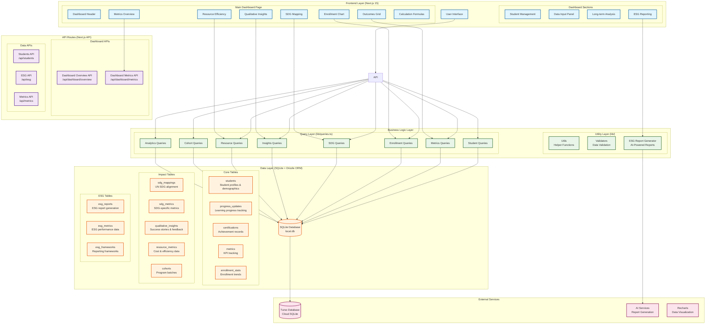

# FrontForumFocus Impact Dashboard - Architecture Overview



## Architecture Overview

The FrontForumFocus Impact Dashboard is built with a modern, scalable architecture designed for tracking and visualizing the impact of AI education programs for marginalized youth in Kenya.

### 🏗️ System Architecture

**Frontend Layer (Next.js 15 + React 19)**
- **Framework**: Next.js 15 with App Router for optimal performance
- **UI Library**: React 19 with modern hooks and concurrent features
- **Styling**: Tailwind CSS 4 for utility-first responsive design
- **Components**: shadcn/ui for consistent, accessible component library
- **Icons**: Lucide React for beautiful, scalable icons
- **Charts**: Recharts for interactive data visualizations

**API Layer (Next.js API Routes)**
- RESTful API endpoints for data operations
- Server-side data fetching and processing
- Error handling and response formatting
- Type-safe API responses with TypeScript

**Business Logic Layer**
- **Query Layer**: Centralized data access patterns using Drizzle ORM
- **Utility Layer**: Helper functions and data validation
- **ESG Report Generator**: AI-powered report generation system

**Data Layer (SQLite + Drizzle ORM)**
- **Database**: SQLite with Turso for cloud synchronization
- **ORM**: Drizzle ORM for type-safe database operations
- **Schema**: Comprehensive database schema with relationships
- **Migrations**: Drizzle migrations for schema versioning

### 📊 Data Flow Architecture

```
User Request → Next.js Page → API Route → Query Function → Database → Response → UI Update
```

1. **User Interaction**: User interacts with dashboard components
2. **Page Rendering**: Next.js renders the page with client/server components
3. **API Calls**: Components fetch data via API routes
4. **Data Processing**: API routes process requests using query functions
5. **Database Operations**: Drizzle ORM executes type-safe SQL queries
6. **Response Formatting**: Data is formatted and returned to the client
7. **UI Updates**: React components update with new data

### 🗂️ Database Schema Overview

**Core Entities:**
- **Students**: Participant profiles, demographics, enrollment data
- **Progress Updates**: Learning progress and AI literacy levels
- **Certifications**: Achievement records and certificates
- **Metrics**: KPI tracking and performance indicators
- **Enrollment Stats**: Historical enrollment trends

**Impact Tracking:**
- **SDG Mappings**: UN Sustainable Development Goals alignment
- **Qualitative Insights**: Success stories and feedback
- **Resource Metrics**: Cost efficiency and resource utilization
- **Cohorts**: Program batches and group management

**ESG Reporting:**
- **ESG Reports**: Generated reports with AI analysis
- **ESG Metrics**: Performance data for ESG frameworks
- **ESG Frameworks**: Supported reporting standards (GRI, SASB, etc.)

### 🔄 Component Architecture

**Dashboard Layout:**
```
DashboardPage (Main Container)
├── DashboardHeader (Navigation & Branding)
└── Tabs (Section Navigation)
    ├── Impact Overview Tab
    │   ├── MetricsOverview (KPI Cards)
    │   ├── EnrollmentChart (Trend Visualization)
    │   ├── OutcomesGrid (Success Metrics)
    │   ├── SDGMapping (Goal Alignment)
    │   ├── ResourceEfficiency (Cost Analysis)
    │   ├── QualitativeInsights (Stories & Feedback)
    │   └── CalculationFormulas (Methodology Documentation)
    ├── Student Management Tab
    │   └── StudentManagement (CRUD Operations)
    ├── Data Input Tab
    │   └── DataInputPanel (Bulk Operations)
    ├── Long-term Analysis Tab
    │   └── LongTermAnalysis (Advanced Analytics)
    └── ESG Reporting Tab
        └── ESGReporting (Report Generation)
```

### 🚀 Performance Optimizations

- **Server-Side Rendering**: Next.js App Router for optimal loading
- **Code Splitting**: Automatic code splitting for better performance
- **Image Optimization**: Next.js Image component for optimized images
- **Caching**: Intelligent caching strategies for API responses
- **Bundle Analysis**: Turbopack for fast development builds

### 🔒 Security Considerations

- **Type Safety**: TypeScript for compile-time error prevention
- **Input Validation**: Server-side validation for all user inputs
- **SQL Injection Prevention**: Drizzle ORM parameterized queries
- **CORS Configuration**: Proper CORS setup for API security
- **Environment Variables**: Secure configuration management

### 📈 Scalability Features

- **Modular Architecture**: Easy to extend with new features
- **Database Optimization**: Indexed queries and efficient data structures
- **API Rate Limiting**: Built-in protection against abuse
- **Caching Layer**: Redis-ready architecture for high performance
- **Microservices Ready**: API-first design for future decomposition

This architecture provides a solid foundation for tracking educational impact while remaining flexible for future enhancements and scaling requirements.</content>
<parameter name="filePath">/workspaces/impact-dash/docs/ARCHITECTURE.md